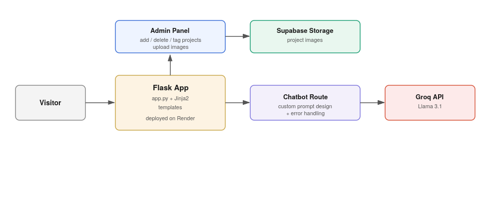
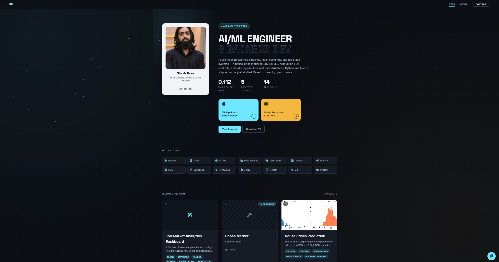
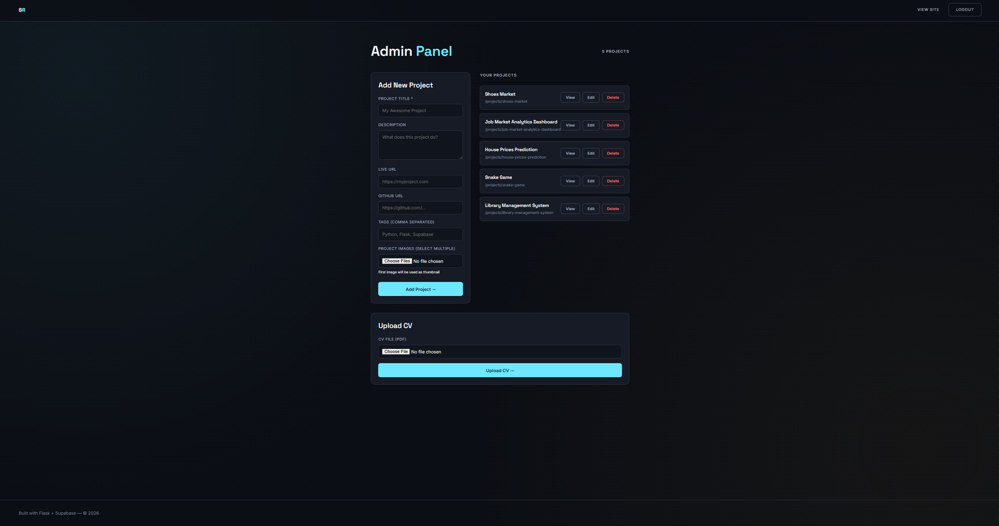
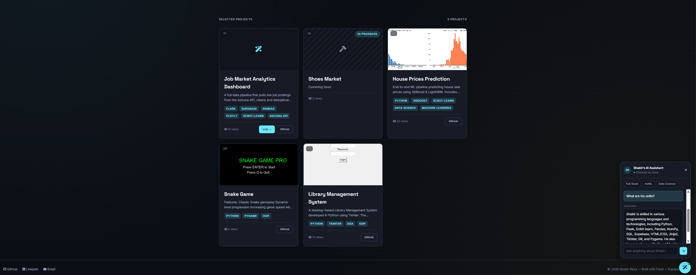

# Portfolio Website

Personal portfolio site with a self-built admin panel for managing project content, and an
AI chatbot that answers visitor questions about my background.

**Live site:** https://shakirraza.onrender.com/

---

## Problem Statement

Most student portfolios are static pages that need a code change and redeploy to update.
I wanted a portfolio I could actually manage — add projects, swap images, update tags — without
touching code each time.

## Solution

A Flask application backed by Supabase, with an admin panel for content management and a
Groq-hosted AI chatbot for interactive visitor questions.

## Architecture



## Tech Stack

Python, Flask, Jinja2, Supabase (PostgreSQL + Storage), Groq API, HTML, CSS, Render

## Features

- Admin panel for managing portfolio projects — add, delete, tag, and upload images —
  without redeploying
- Project images stored and served via Supabase Storage
- AI chatbot (Groq-hosted Llama 3.1) with custom prompt design and error handling, answering
  visitor questions about my background in natural language
- Deployed to production on Render

## Screenshots





## Installation

```bash
git clone https://github.com/Shakir-Raza/portfolio.git
cd portfolio
python -m venv venv
source venv/bin/activate      # Windows: venv\Scripts\activate
pip install -r requirements.txt
```

You'll need your own Supabase and Groq API credentials set up locally to run this (not
included here for security reasons).

## Usage

```bash
python app.py
```

Visit `http://localhost:5000`. Admin routes require login (set up your own admin credentials
in `.env` or your auth setup).

## Future Improvements

- Add automated tests for the admin panel's CRUD operations
- Add image optimization/resizing on upload rather than storing originals as-is
- Rate-limit the chatbot endpoint to control API costs
